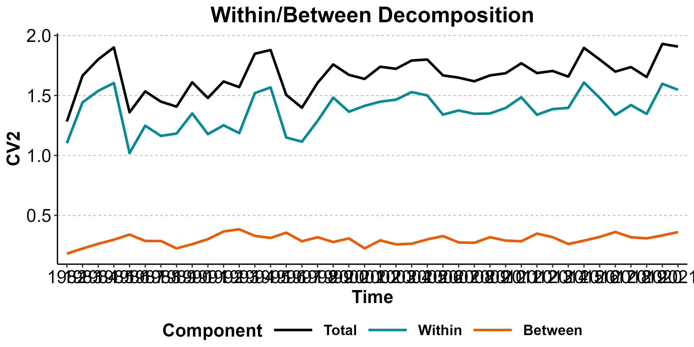
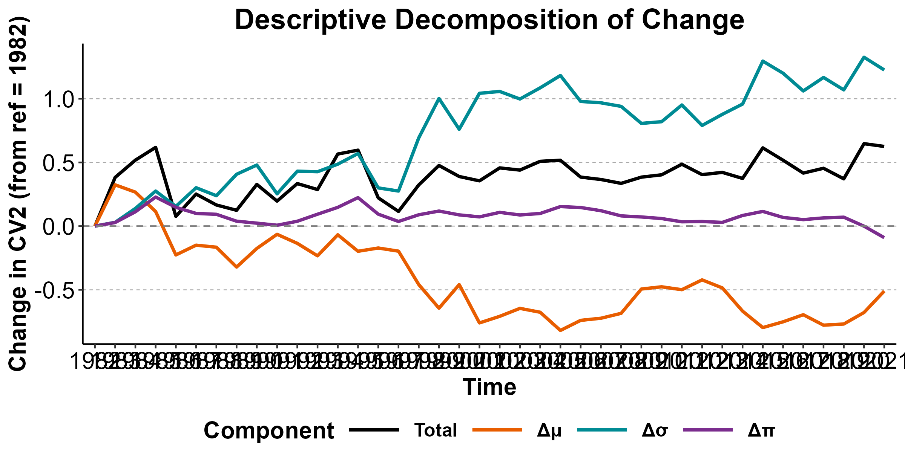
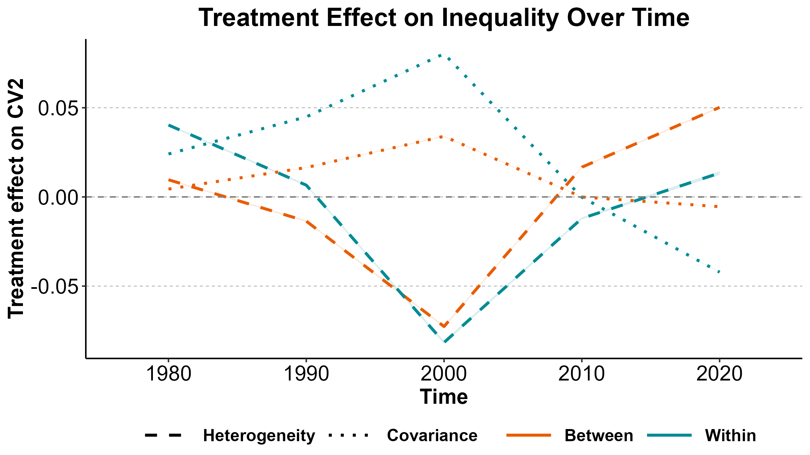
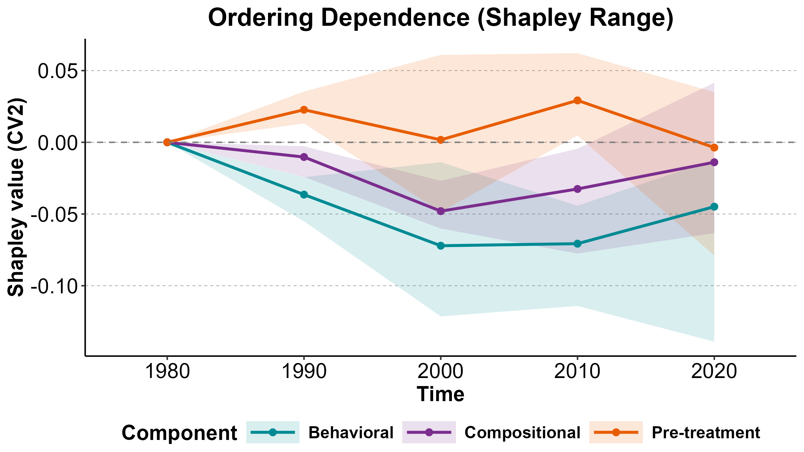

# Examples

Two short worked examples. Both run on the package’s bundled
`cps_sample` (a 65k-row CPS subsample, 1982–2021) and aim to show the
package’s two main modes — descriptive and causal — without doing a full
analysis.

- [Example 1: Descriptive within/between decomposition](#e1)
- [Example 2: Causal decomposition — the motherhood penalty](#e2)

``` r

library(ineqx)
data("cps_sample")
```

------------------------------------------------------------------------

### Example 1: Descriptive within/between decomposition

Women in `cps_sample` are grouped into low/medium/high SES
(`SES = 1, 2, 3`) based on household income. We ask: how much earnings
inequality lies *within* each SES tier vs *between* tiers, and how has
that changed since 1982?

``` r

desc <- ineqx(
  y = "earnweekf", ystat = "CV2",
  group = "SES",
  time = "year", ref = 1982,
  weights = "earnwtf",
  data = cps_sample
)
```

We use `ystat = "CV2"` (squared coefficient of variation,
$`\sigma^2/\mu^2`$) rather than `"Var"` so that the high-income tier
doesn’t mechanically dominate the decomposition. `"VL"` (variance of
logs) is also accepted but is generally not recommended — see the FAQ.

``` r

print(desc)
#> Descriptive variance decomposition
#> Inequality measure: CV2 
#> Reference period: 1982 
#> Ordering: shapley 
#> 
#> Totals by time:
#>  time  CV2W   CV2B  CV2T
#>  1982 1.102 0.1802 1.283
#>  1983 1.442 0.2230 1.665
#>  1984 1.538 0.2624 1.801
#>  1985 1.604 0.2968 1.901
#>  1986 1.020 0.3396 1.359
#>  1987 1.248 0.2863 1.534
#>  1988 1.163 0.2860 1.449
#>  1989 1.182 0.2245 1.407
#>  1990 1.350 0.2597 1.610
#>  1991 1.178 0.3013 1.479
#>  1992 1.251 0.3653 1.617
#>  1993 1.186 0.3839 1.570
#>  1994 1.520 0.3283 1.848
#>  1995 1.567 0.3118 1.879
#>  1996 1.149 0.3554 1.505
#>  1997 1.115 0.2835 1.398
#>  1998 1.288 0.3175 1.606
#>  1999 1.481 0.2774 1.759
#>  2000 1.364 0.3076 1.672
#>  2001 1.413 0.2247 1.638
#>  2002 1.448 0.2911 1.740
#>  2003 1.465 0.2579 1.722
#>  2004 1.528 0.2630 1.791
#>  2005 1.500 0.2993 1.800
#>  2006 1.340 0.3273 1.668
#>  2007 1.375 0.2738 1.649
#>  2008 1.347 0.2711 1.618
#>  2009 1.349 0.3178 1.667
#>  2010 1.396 0.2894 1.685
#>  2011 1.485 0.2838 1.769
#>  2012 1.339 0.3478 1.687
#>  2013 1.386 0.3181 1.704
#>  2014 1.397 0.2605 1.657
#>  2015 1.608 0.2890 1.897
#>  2016 1.480 0.3199 1.800
#>  2017 1.338 0.3613 1.699
#>  2018 1.420 0.3169 1.737
#>  2019 1.346 0.3079 1.654
#>  2020 1.597 0.3326 1.930
#>  2021 1.547 0.3608 1.908
#> 
#> Decomposition of changes in CV2 relative to ref = 1982:
#> 
#>   time 1982: (reference)
#> 
#>   time 1983:
#>     Between-group (delta_mu):                    0.3242
#>       Between-group:                             0.0187
#>       Within-group:                              0.3055
#>     Within-group (delta_sigma):                  0.0300
#>     Compositional (delta_pi):                    0.0284
#>       Between-group:                             0.0241
#>       Within-group:                              0.0043
#>     Total:                                       0.3825
#> 
#>   time 1984:
#>     Between-group (delta_mu):                    0.2669
#>       Between-group:                             0.0302
#>       Within-group:                              0.2367
#>     Within-group (delta_sigma):                  0.1388
#>     Compositional (delta_pi):                    0.1125
#>       Between-group:                             0.0520
#>       Within-group:                              0.0604
#>     Total:                                       0.5181
#> 
#>   time 1985:
#>     Between-group (delta_mu):                    0.1145
#>       Between-group:                             0.0356
#>       Within-group:                              0.0789
#>     Within-group (delta_sigma):                  0.2754
#>     Compositional (delta_pi):                    0.2282
#>       Between-group:                             0.0810
#>       Within-group:                              0.1472
#>     Total:                                       0.6181
#> 
#>   time 1986:
#>     Between-group (delta_mu):                   -0.2263
#>       Between-group:                             0.0905
#>       Within-group:                             -0.3168
#>     Within-group (delta_sigma):                  0.1551
#>     Compositional (delta_pi):                    0.1478
#>       Between-group:                             0.0689
#>       Within-group:                              0.0790
#>     Total:                                       0.0766
#> 
#>   time 1987:
#>     Between-group (delta_mu):                   -0.1496
#>       Between-group:                             0.0744
#>       Within-group:                             -0.2240
#>     Within-group (delta_sigma):                  0.3015
#>     Compositional (delta_pi):                    0.0997
#>       Between-group:                             0.0317
#>       Within-group:                              0.0680
#>     Total:                                       0.2516
#> 
#>   time 1988:
#>     Between-group (delta_mu):                   -0.1656
#>       Between-group:                             0.0691
#>       Within-group:                             -0.2347
#>     Within-group (delta_sigma):                  0.2389
#>     Compositional (delta_pi):                    0.0928
#>       Between-group:                             0.0366
#>       Within-group:                              0.0561
#>     Total:                                       0.1661
#> 
#>   time 1989:
#>     Between-group (delta_mu):                   -0.3214
#>       Between-group:                             0.0230
#>       Within-group:                             -0.3444
#>     Within-group (delta_sigma):                  0.4070
#>     Compositional (delta_pi):                    0.0386
#>       Between-group:                             0.0213
#>       Within-group:                              0.0173
#>     Total:                                       0.1243
#> 
#>   time 1990:
#>     Between-group (delta_mu):                   -0.1754
#>       Between-group:                             0.0614
#>       Within-group:                             -0.2369
#>     Within-group (delta_sigma):                  0.4797
#>     Compositional (delta_pi):                    0.0233
#>       Between-group:                             0.0181
#>       Within-group:                              0.0052
#>     Total:                                       0.3275
#> 
#>   time 1991:
#>     Between-group (delta_mu):                   -0.0642
#>       Between-group:                             0.0920
#>       Within-group:                             -0.1562
#>     Within-group (delta_sigma):                  0.2537
#>     Compositional (delta_pi):                    0.0070
#>       Between-group:                             0.0291
#>       Within-group:                             -0.0221
#>     Total:                                       0.1964
#> 
#>   time 1992:
#>     Between-group (delta_mu):                   -0.1353
#>       Between-group:                             0.1465
#>       Within-group:                             -0.2818
#>     Within-group (delta_sigma):                  0.4312
#>     Compositional (delta_pi):                    0.0382
#>       Between-group:                             0.0386
#>       Within-group:                             -0.0004
#>     Total:                                       0.3341
#> 
#>   time 1993:
#>     Between-group (delta_mu):                   -0.2333
#>       Between-group:                             0.1576
#>       Within-group:                             -0.3909
#>     Within-group (delta_sigma):                  0.4271
#>     Compositional (delta_pi):                    0.0935
#>       Between-group:                             0.0461
#>       Within-group:                              0.0475
#>     Total:                                       0.2873
#> 
#>   time 1994:
#>     Between-group (delta_mu):                   -0.0680
#>       Between-group:                             0.0852
#>       Within-group:                             -0.1532
#>     Within-group (delta_sigma):                  0.4865
#>     Compositional (delta_pi):                    0.1473
#>       Between-group:                             0.0629
#>       Within-group:                              0.0845
#>     Total:                                       0.5659
#> 
#>   time 1995:
#>     Between-group (delta_mu):                   -0.1974
#>       Between-group:                             0.0513
#>       Within-group:                             -0.2488
#>     Within-group (delta_sigma):                  0.5700
#>     Compositional (delta_pi):                    0.2239
#>       Between-group:                             0.0803
#>       Within-group:                              0.1436
#>     Total:                                       0.5964
#> 
#>   time 1996:
#>     Between-group (delta_mu):                   -0.1719
#>       Between-group:                             0.1218
#>       Within-group:                             -0.2937
#>     Within-group (delta_sigma):                  0.3001
#>     Compositional (delta_pi):                    0.0938
#>       Between-group:                             0.0534
#>       Within-group:                              0.0404
#>     Total:                                       0.2220
#> 
#>   time 1997:
#>     Between-group (delta_mu):                   -0.1966
#>       Between-group:                             0.0710
#>       Within-group:                             -0.2676
#>     Within-group (delta_sigma):                  0.2754
#>     Compositional (delta_pi):                    0.0367
#>       Between-group:                             0.0323
#>       Within-group:                              0.0044
#>     Total:                                       0.1155
#> 
#>   time 1998:
#>     Between-group (delta_mu):                   -0.4586
#>       Between-group:                             0.1011
#>       Within-group:                             -0.5596
#>     Within-group (delta_sigma):                  0.6926
#>     Compositional (delta_pi):                    0.0890
#>       Between-group:                             0.0362
#>       Within-group:                              0.0528
#>     Total:                                       0.3231
#> 
#>   time 1999:
#>     Between-group (delta_mu):                   -0.6443
#>       Between-group:                             0.0453
#>       Within-group:                             -0.6895
#>     Within-group (delta_sigma):                  1.0023
#>     Compositional (delta_pi):                    0.1183
#>       Between-group:                             0.0519
#>       Within-group:                              0.0664
#>     Total:                                       0.4763
#> 
#>   time 2000:
#>     Between-group (delta_mu):                   -0.4592
#>       Between-group:                             0.0780
#>       Within-group:                             -0.5373
#>     Within-group (delta_sigma):                  0.7606
#>     Compositional (delta_pi):                    0.0882
#>       Between-group:                             0.0493
#>       Within-group:                              0.0388
#>     Total:                                       0.3895
#> 
#>   time 2001:
#>     Between-group (delta_mu):                   -0.7600
#>       Between-group:                             0.0080
#>       Within-group:                             -0.7681
#>     Within-group (delta_sigma):                  1.0428
#>     Compositional (delta_pi):                    0.0727
#>       Between-group:                             0.0364
#>       Within-group:                              0.0363
#>     Total:                                       0.3555
#> 
#>   time 2002:
#>     Between-group (delta_mu):                   -0.7083
#>       Between-group:                             0.0741
#>       Within-group:                             -0.7824
#>     Within-group (delta_sigma):                  1.0574
#>     Compositional (delta_pi):                    0.1079
#>       Between-group:                             0.0369
#>       Within-group:                              0.0711
#>     Total:                                       0.4570
#> 
#>   time 2003:
#>     Between-group (delta_mu):                   -0.6458
#>       Between-group:                             0.0471
#>       Within-group:                             -0.6929
#>     Within-group (delta_sigma):                  0.9981
#>     Compositional (delta_pi):                    0.0877
#>       Between-group:                             0.0305
#>       Within-group:                              0.0571
#>     Total:                                       0.4399
#> 
#>   time 2004:
#>     Between-group (delta_mu):                   -0.6762
#>       Between-group:                             0.0365
#>       Within-group:                             -0.7127
#>     Within-group (delta_sigma):                  1.0857
#>     Compositional (delta_pi):                    0.0993
#>       Between-group:                             0.0463
#>       Within-group:                              0.0529
#>     Total:                                       0.5087
#> 
#>   time 2005:
#>     Between-group (delta_mu):                   -0.8191
#>       Between-group:                             0.0443
#>       Within-group:                             -0.8634
#>     Within-group (delta_sigma):                  1.1826
#>     Compositional (delta_pi):                    0.1535
#>       Between-group:                             0.0748
#>       Within-group:                              0.0787
#>     Total:                                       0.5170
#> 
#>   time 2006:
#>     Between-group (delta_mu):                   -0.7400
#>       Between-group:                             0.0700
#>       Within-group:                             -0.8099
#>     Within-group (delta_sigma):                  0.9788
#>     Compositional (delta_pi):                    0.1461
#>       Between-group:                             0.0771
#>       Within-group:                              0.0690
#>     Total:                                       0.3850
#> 
#>   time 2007:
#>     Between-group (delta_mu):                   -0.7233
#>       Between-group:                             0.0326
#>       Within-group:                             -0.7558
#>     Within-group (delta_sigma):                  0.9683
#>     Compositional (delta_pi):                    0.1211
#>       Between-group:                             0.0611
#>       Within-group:                              0.0601
#>     Total:                                       0.3661
#> 
#>   time 2008:
#>     Between-group (delta_mu):                   -0.6848
#>       Between-group:                             0.0341
#>       Within-group:                             -0.7189
#>     Within-group (delta_sigma):                  0.9402
#>     Compositional (delta_pi):                    0.0803
#>       Between-group:                             0.0567
#>       Within-group:                              0.0236
#>     Total:                                       0.3357
#> 
#>   time 2009:
#>     Between-group (delta_mu):                   -0.4939
#>       Between-group:                             0.0833
#>       Within-group:                             -0.5772
#>     Within-group (delta_sigma):                  0.8065
#>     Compositional (delta_pi):                    0.0720
#>       Between-group:                             0.0542
#>       Within-group:                              0.0177
#>     Total:                                       0.3846
#> 
#>   time 2010:
#>     Between-group (delta_mu):                   -0.4765
#>       Between-group:                             0.0618
#>       Within-group:                             -0.5383
#>     Within-group (delta_sigma):                  0.8199
#>     Compositional (delta_pi):                    0.0594
#>       Between-group:                             0.0474
#>       Within-group:                              0.0120
#>     Total:                                       0.4028
#> 
#>   time 2011:
#>     Between-group (delta_mu):                   -0.4991
#>       Between-group:                             0.0622
#>       Within-group:                             -0.5613
#>     Within-group (delta_sigma):                  0.9512
#>     Compositional (delta_pi):                    0.0340
#>       Between-group:                             0.0414
#>       Within-group:                             -0.0074
#>     Total:                                       0.4861
#> 
#>   time 2012:
#>     Between-group (delta_mu):                   -0.4220
#>       Between-group:                             0.1190
#>       Within-group:                             -0.5410
#>     Within-group (delta_sigma):                  0.7901
#>     Compositional (delta_pi):                    0.0362
#>       Between-group:                             0.0486
#>       Within-group:                             -0.0124
#>     Total:                                       0.4043
#> 
#>   time 2013:
#>     Between-group (delta_mu):                   -0.4851
#>       Between-group:                             0.0871
#>       Within-group:                             -0.5722
#>     Within-group (delta_sigma):                  0.8777
#>     Compositional (delta_pi):                    0.0293
#>       Between-group:                             0.0508
#>       Within-group:                             -0.0215
#>     Total:                                       0.4219
#> 
#>   time 2014:
#>     Between-group (delta_mu):                   -0.6674
#>       Between-group:                             0.0374
#>       Within-group:                             -0.7048
#>     Within-group (delta_sigma):                  0.9583
#>     Compositional (delta_pi):                    0.0836
#>       Between-group:                             0.0429
#>       Within-group:                              0.0407
#>     Total:                                       0.3745
#> 
#>   time 2015:
#>     Between-group (delta_mu):                   -0.7966
#>       Between-group:                             0.0779
#>       Within-group:                             -0.8744
#>     Within-group (delta_sigma):                  1.2956
#>     Compositional (delta_pi):                    0.1154
#>       Between-group:                             0.0309
#>       Within-group:                              0.0845
#>     Total:                                       0.6144
#> 
#>   time 2016:
#>     Between-group (delta_mu):                   -0.7514
#>       Between-group:                             0.1163
#>       Within-group:                             -0.8678
#>     Within-group (delta_sigma):                  1.2006
#>     Compositional (delta_pi):                    0.0683
#>       Between-group:                             0.0234
#>       Within-group:                              0.0450
#>     Total:                                       0.5175
#> 
#>   time 2017:
#>     Between-group (delta_mu):                   -0.6956
#>       Between-group:                             0.1633
#>       Within-group:                             -0.8589
#>     Within-group (delta_sigma):                  1.0611
#>     Compositional (delta_pi):                    0.0509
#>       Between-group:                             0.0177
#>       Within-group:                              0.0332
#>     Total:                                       0.4165
#> 
#>   time 2018:
#>     Between-group (delta_mu):                   -0.7777
#>       Between-group:                             0.1059
#>       Within-group:                             -0.8836
#>     Within-group (delta_sigma):                  1.1674
#>     Compositional (delta_pi):                    0.0646
#>       Between-group:                             0.0308
#>       Within-group:                              0.0337
#>     Total:                                       0.4542
#> 
#>   time 2019:
#>     Between-group (delta_mu):                   -0.7686
#>       Between-group:                             0.0875
#>       Within-group:                             -0.8561
#>     Within-group (delta_sigma):                  1.0697
#>     Compositional (delta_pi):                    0.0702
#>       Between-group:                             0.0402
#>       Within-group:                              0.0300
#>     Total:                                       0.3713
#> 
#>   time 2020:
#>     Between-group (delta_mu):                   -0.6783
#>       Between-group:                             0.1364
#>       Within-group:                             -0.8147
#>     Within-group (delta_sigma):                  1.3261
#>     Compositional (delta_pi):                   -0.0004
#>       Between-group:                             0.0159
#>       Within-group:                             -0.0163
#>     Total:                                       0.6473
#> 
#>   time 2021:
#>     Between-group (delta_mu):                   -0.5099
#>       Between-group:                             0.1920
#>       Within-group:                             -0.7020
#>     Within-group (delta_sigma):                  1.2261
#>     Compositional (delta_pi):                   -0.0905
#>       Between-group:                            -0.0114
#>       Within-group:                             -0.0791
#>     Total:                                       0.6256
```

Within- vs between-group inequality over time:

``` r

plot(desc, type = "wibe")
```



Decomposition of the change since 1982 into contributions from changing
means ($`\Delta_\mu`$), changing dispersions ($`\Delta_\sigma`$), and
changing group shares ($`\Delta_\pi`$):

``` r

plot(desc, type = "decomp")
```



Most of the increase in $`CV^2`$ since 1982 traces to changes in
within-group dispersion ($`\Delta_\sigma`$) — earnings inequality has
grown *within* SES tiers, not just *between* them. This is the basic
motivation for taking within-group inequality seriously.

------------------------------------------------------------------------

### Example 2: Causal decomposition — the motherhood penalty

Same dataset, now asking a causal question: how does motherhood affect
earnings inequality among women, and how has that effect changed?

We restrict the sample to women of childbearing age and fit a
difference-in- differences model (treatment = `mother`, post-period =
`byear`) with education-by-decade interactions for both the mean and
log-SD of earnings. GAMLSS does the heavy lifting internally.

``` r

df <- subset(cps_sample,
             age >= 18 & age <= 49 & !is.na(earnweekf) & earnweekf > 0)

causal <- ineqx(
  y = "earnweekf", ystat = "CV2",
  treat = "mother", post = "byear",
  group = "edu",
  time = "year10", ref = 1980,
  formula_mu    = ~ mother * byear * factor(edu) * factor(year10) + age,
  formula_sigma = ~ mother * byear * factor(edu) * factor(year10),
  weights = "earnwtf",
  se = "delta",
  data = df
)
#> GAMLSS-RS iteration 1: Global Deviance = 3535424937 
#> GAMLSS-RS iteration 2: Global Deviance = 3534988768 
#> GAMLSS-RS iteration 3: Global Deviance = 3534986071 
#> GAMLSS-RS iteration 4: Global Deviance = 3534986056 
#> GAMLSS-RS iteration 5: Global Deviance = 3534986056 
#> GAMLSS-RS iteration 6: Global Deviance = 3534986056
```

#### Cross-sectional split: het and cov sub-components

The treatment effect on inequality at each time decomposes into
$`\tau_B = \text{het}_B + \text{cov}_B`$ (between groups) and
$`\tau_W = \text{het}_W + \text{cov}_W`$ (within groups). See the [Model
structure](https://benrosche.github.io/ineqx/articles/model.md) page for
the exact formulas. `plot(..., type = "wibe", stats = ...)` shows all
four series at once:

``` r

plot(causal, type = "wibe",
     stats = c("het_b", "cov_b", "het_w", "cov_w"),
     ci = TRUE)
```



The dominant series here is **`het_W`** — the within-group component
driven by the average treatment effect on log-SD ($`\bar\lambda`$). It
is negative and large: motherhood compresses within-education earnings
dispersion. The between-group **`cov_B`** term (sorting of mean effects
$`\beta`$ across education groups) is small and runs in the opposite
direction. Note this is exactly the kind of pattern that mean-based
methods miss.

#### Longitudinal: behavioral / compositional / pre-treatment

How has the motherhood effect’s contribution to inequality *changed*
since 1980? `type = "shapley"` displays the three-channel decomposition
with the range across the six possible orderings:

``` r

plot(causal, type = "shapley")
```



The **compositional** channel ($`\Delta_\pi`$) is large and negative —
the share of childbearing-age women who are mothers has dropped
substantially since 1980, and that compositional shift on its own
reduces the contribution of motherhood to overall inequality. Behavioral
changes ($`\Delta_\beta +
\Delta_\lambda`$, how motherhood’s per-group effects have changed) are
smaller, and pre-treatment shifts ($`\Delta_\mu + \Delta_\sigma`$,
baseline inequality changes) contribute a modest negative term.

A more thorough analysis would add controls for race, marital status,
age splines, and family size; would model the pre-trends formally; and
would use bootstrap rather than delta-method SEs. See
[`?ineqx`](https://benrosche.github.io/ineqx/reference/ineqx.md),
[`?boot_config`](https://benrosche.github.io/ineqx/reference/boot_config.md),
and the
[Tutorial](https://benrosche.github.io/ineqx/articles/tutorial.md) for
the full toolbox.
