# Getting Started with ineqx

This tutorial walks through the three main workflows of the **ineqx**
package:

1.  [Descriptive decomposition](#descriptive) — split inequality into
    within- and between-group components
2.  [Causal decomposition](#causal) — decompose treatment effects on
    inequality
3.  [External GAMLSS model](#gamlss) — bring your own model, extract
    parameters, and decompose

The package has two user-facing functions:

| Function | Purpose |
|----|----|
| [`ineqx()`](https://benrosche.github.io/ineqx/reference/ineqx.md) | Variance decomposition — descriptive (no `treat`) or causal (with `treat` or `params`) |
| [`ineqx_params()`](https://benrosche.github.io/ineqx/reference/ineqx_params.md) | Create parameter object — manually or from a fitted gamlss |

We use the simulated `incdat` dataset that ships with the package. It
contains panel data on individuals across multiple years, three groups
(`group = 1, 2, 3`), and a binary treatment indicator (`x`).

``` r

devtools::load_all()
#> ℹ Loading ineqx

data("incdat")
str(incdat)
#> tibble [3,000 × 7] (S3: tbl_df/tbl/data.frame)
#>  $ id   : int [1:3000] 1 1 2 2 3 3 4 4 5 5 ...
#>  $ year : int [1:3000] 1 1 1 1 1 1 1 1 1 1 ...
#>  $ group: int [1:3000] 1 1 1 1 1 1 1 1 1 1 ...
#>  $ x    : num [1:3000] 0 0 1 1 1 1 1 1 1 1 ...
#>  $ t    : int [1:3000] 0 1 0 1 0 1 0 1 0 1 ...
#>  $ inc  : num [1:3000] 9.88 9.09 8.56 19.2 11.25 ...
#>  $ lninc: num [1:3000] 2.29 2.21 2.15 2.96 2.42 ...
```

------------------------------------------------------------------------

## 1. Descriptive decomposition

The simplest use case: given an outcome and a grouping variable, how
much inequality is *within* groups versus *between* groups? When no
`treat` argument is provided,
[`ineqx()`](https://benrosche.github.io/ineqx/reference/ineqx.md)
performs a descriptive decomposition.

``` r

desc <- ineqx(
  y     = "inc",
  group = "group",
  time  = "year",
  ref   = 1,
  ystat = "Var",
  data  = incdat
)
#> Computing descriptive decomposition...
#> Finished.

print(desc)
#> Descriptive variance decomposition
#> Inequality measure: Var 
#> Reference period: 1 
#> Ordering: shapley 
#> 
#> Totals by time:
#>  time   VarW     VarB   VarT
#>     1  40.28  1.23480  41.52
#>     2  59.28  0.03878  59.32
#>     3  90.50  1.83958  92.34
#>     4 136.19  6.49804 142.69
#>     5 192.58 12.92182 205.50
#> 
#> Decomposition of changes in Var relative to ref = 1:
#> 
#>   time 1: (reference)
#> 
#>   time 2:
#>     Between-group (delta_mu):                   -1.1960
#>     Within-group (delta_sigma):                 18.9966
#>     Compositional (delta_pi):                    0.0000
#>       Between-group:                             0.0000
#>       Within-group:                              0.0000
#>     Total:                                      17.8005
#> 
#>   time 3:
#>     Between-group (delta_mu):                    0.6048
#>     Within-group (delta_sigma):                 50.2203
#>     Compositional (delta_pi):                    0.0000
#>       Between-group:                             0.0000
#>       Within-group:                              0.0000
#>     Total:                                      50.8251
#> 
#>   time 4:
#>     Between-group (delta_mu):                    5.2632
#>     Within-group (delta_sigma):                 95.9118
#>     Compositional (delta_pi):                    0.0000
#>       Between-group:                             0.0000
#>       Within-group:                              0.0000
#>     Total:                                     101.1750
#> 
#>   time 5:
#>     Between-group (delta_mu):                   11.6870
#>     Within-group (delta_sigma):                152.2994
#>     Compositional (delta_pi):                    0.0000
#>       Between-group:                             0.0000
#>       Within-group:                              0.0000
#>     Total:                                     163.9864
```

When a time variable and reference period are provided,
[`ineqx()`](https://benrosche.github.io/ineqx/reference/ineqx.md)
computes within-group, between-group, and total inequality for each
period, and decomposes the change over time into contributions from
changing group means ($`\mu`$), dispersions ($`\sigma`$), and
composition ($`\pi`$), using Shapley averaging by default.

``` r

plot(desc)
```

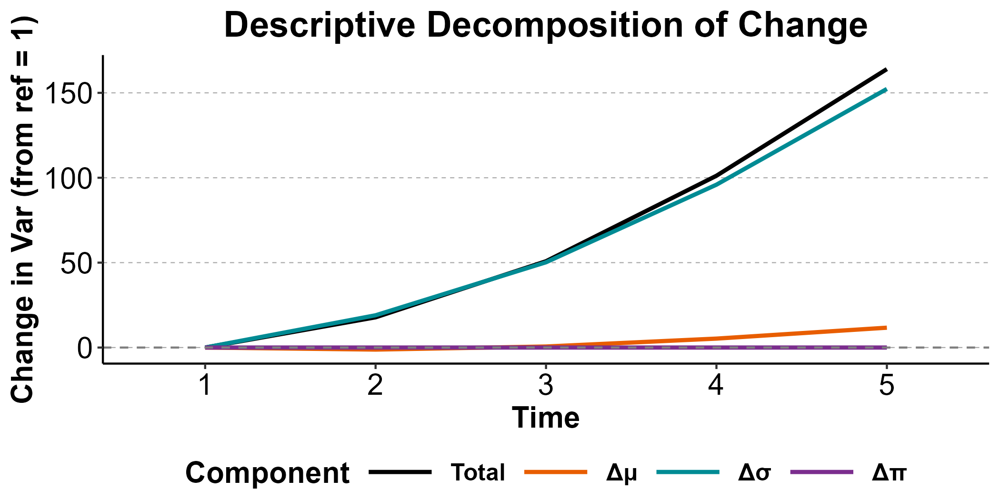

The default plot type is `"decomp"`, which shows how inequality changed
relative to the reference period and decomposes that change into
$`\mu`$, $`\sigma`$, and $`\pi`$ contributions.

### Within/between levels

The `type = "wibe"` plot shows the raw within-group, between-group, and
total inequality at each time point:

``` r

plot(desc, type = "wibe")
```

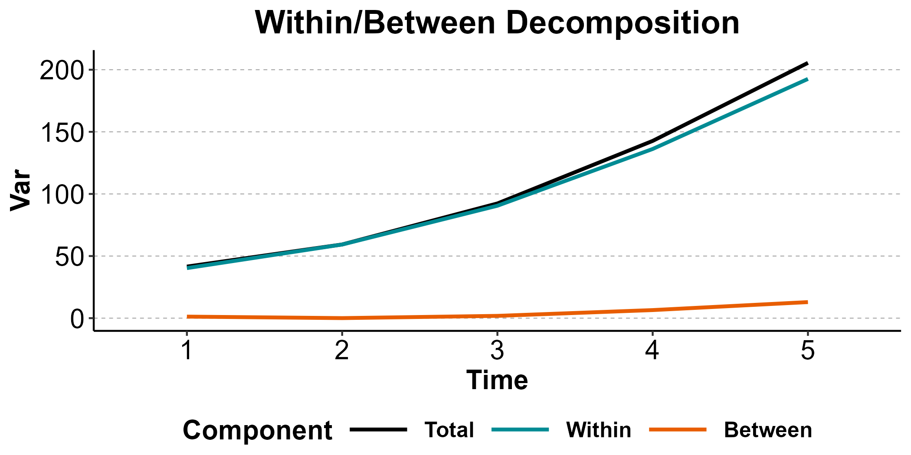

### Group-level parameters

The `type = "params"` plot shows group-level means and standard
deviations over time. Pass `ci = TRUE` or `ci = "delta"` to add
confidence intervals:

``` r

plot(desc, type = "params")
```

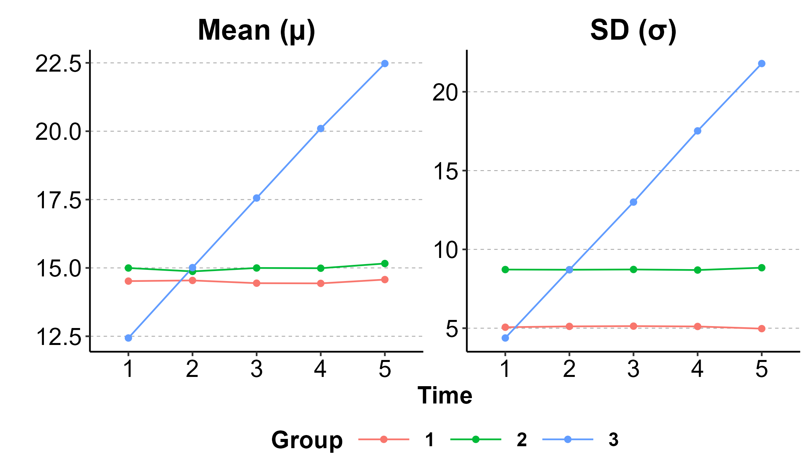

### Inequality statistics

The `type = "ineq"` plot computes and displays overall inequality
statistics over time. You can choose from `"V"` (variance), `"VL"`
(log-variance), `"CV2"`, `"Gini"`, and `"Theil"`, or pass custom
functions:

``` r

plot(desc, type = "ineq", stats = c("V", "Gini"))
```

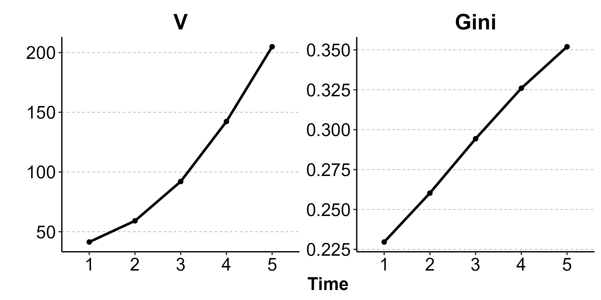

The `type = "ineq.group"` variant shows per-group inequality statistics:

``` r

plot(desc, type = "ineq.group", stats = c("V"))
```

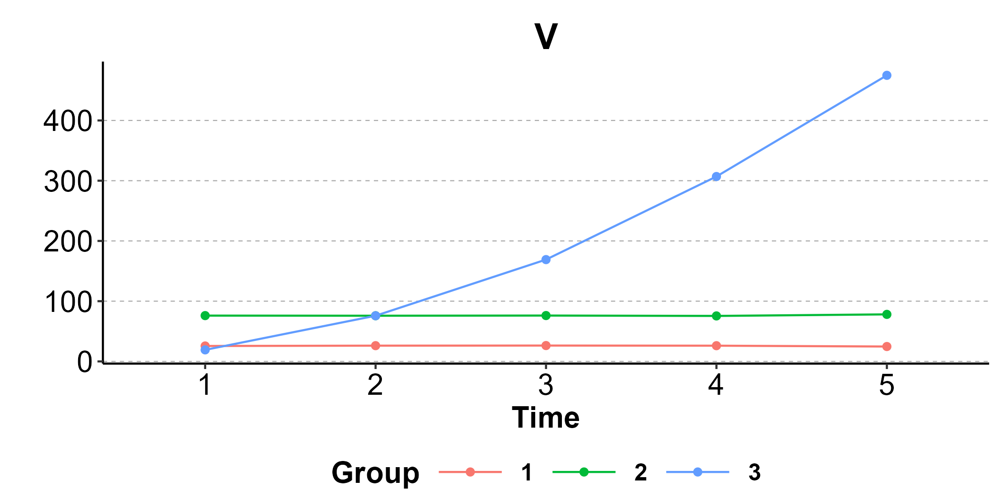

### Counterfactual reference

You can decompose inequality relative to a counterfactual baseline by
passing a descriptive params object via `params`. Create it with
[`ineqx_params()`](https://benrosche.github.io/ineqx/reference/ineqx_params.md)
using columns `group`, `pi`, `mu`, `sigma` — this parallels the causal
path where `params` supplies the reference state.

For example, to decompose the observed inequality into contributions
from group means, dispersions, and composition relative to a world of
perfect equality (all parameters zero, equal group shares):

``` r

ref <- ineqx_params(
  data = data.frame(
    group = 1:3,
    pi    = 1/3,
    mu    = 0,
    sigma = 0
  )
)

desc_ref <- ineqx(
  y     = "inc",
  ystat = "Var",
  group = "group",
  time  = "year",
  params = ref,
  data  = incdat
)
#> Computing descriptive decomposition...
#> Finished.

print(desc_ref)
#> Descriptive variance decomposition
#> Inequality measure: Var 
#> Reference period: 0 
#> Ordering: shapley 
#> 
#> Totals by time:
#>  time   VarW     VarB   VarT
#>     0   0.00  0.00000   0.00
#>     1  40.28  1.23480  41.52
#>     2  59.28  0.03878  59.32
#>     3  90.50  1.83958  92.34
#>     4 136.19  6.49804 142.69
#>     5 192.58 12.92182 205.50
#> 
#> Decomposition of changes in Var relative to counterfactual reference:
#> 
#>   time 0: (reference)
#> 
#>   time 1:
#>     Between-group (delta_mu):                    1.2348
#>     Within-group (delta_sigma):                 40.2821
#>     Compositional (delta_pi):                    0.0000
#>       Between-group:                             0.0000
#>       Within-group:                              0.0000
#>     Total:                                      41.5169
#> 
#>   time 2:
#>     Between-group (delta_mu):                    0.0388
#>     Within-group (delta_sigma):                 59.2786
#>     Compositional (delta_pi):                    0.0000
#>       Between-group:                             0.0000
#>       Within-group:                              0.0000
#>     Total:                                      59.3174
#> 
#>   time 3:
#>     Between-group (delta_mu):                    1.8396
#>     Within-group (delta_sigma):                 90.5024
#>     Compositional (delta_pi):                    0.0000
#>       Between-group:                             0.0000
#>       Within-group:                              0.0000
#>     Total:                                      92.3419
#> 
#>   time 4:
#>     Between-group (delta_mu):                    6.4980
#>     Within-group (delta_sigma):                136.1939
#>     Compositional (delta_pi):                    0.0000
#>       Between-group:                             0.0000
#>       Within-group:                              0.0000
#>     Total:                                     142.6919
#> 
#>   time 5:
#>     Between-group (delta_mu):                   12.9218
#>     Within-group (delta_sigma):                192.5815
#>     Compositional (delta_pi):                    0.0000
#>       Between-group:                             0.0000
#>       Within-group:                              0.0000
#>     Total:                                     205.5033
```

The deltas show how much each parameter contributes to the level of
inequality at each time period: $`\mu`$ drives between-group inequality,
$`\sigma`$ drives within-group inequality, and $`\pi`$ captures the
effect of unequal group sizes.

------------------------------------------------------------------------

## 2. Causal decomposition

The causal decomposition answers a different question: *how does a
treatment affect inequality?* It decomposes the treatment’s total effect
on variance into:

- **Between-group** (behavioral): does treatment raise means more in
  some groups than others?
- **Within-group** (behavioral): does treatment compress or expand
  dispersion within groups?

### Integrated estimation

The simplest approach: pass formulas and data directly to
[`ineqx()`](https://benrosche.github.io/ineqx/reference/ineqx.md), which
fits a GAMLSS model internally. Note that `formula_mu` is one-sided —
the outcome is specified via the `y` argument:

``` r

result <- ineqx(
  y             = "inc",
  treat         = "x",
  group         = "group",
  formula_mu    = ~ x * factor(group),
  formula_sigma = ~ x * factor(group),
  se            = "delta",
  data          = incdat
)
#> GAMLSS-RS iteration 1: Global Deviance = 16642.58 
#> GAMLSS-RS iteration 2: Global Deviance = 16642.58

print(result)
#> Cross-sectional causal variance decomposition
#> Inequality measure: Var 
#> SEs via delta method
#> 
#> Treatment effect on outcome variance:
#>     Var[Y | T = 0]:                          0.9791  (SE = 0.0681)
#>     Var[Y | T = 1]:                        142.4776  (SE = 6.3270)
#>     Total effect (tau_T):                  141.4984  (SE = 6.3274)
#>       Between-group (tau_B):                17.4602  (SE = 2.6803)
#>       Within-group (tau_W):                124.0382  (SE = 5.7317)
#>       -> Wald test H0: lambda = 0: chi2(3) = 7364.6732, p < 0.0001
#>          Significant: evidence of treatment effect heterogeneity
#>       -> Wald test H0: beta homogeneous (constant absolute effect): chi2(2) = 231.0151, p < 0.0001
#>          Significant: effect on the mean differs across groups
#> 
#> Between-group sub-components:
#>     Var_pi(beta):                           17.6956  (SE = 2.7254)
#>     2*Cov_pi(mu0, beta):                    -0.2354  (SE = 0.3985)
#> 
#> Within-group sub-components:
#>     mean(sigma0^2) * mean(f):              125.6536  (SE = 9.4712)
#>     Cov_pi(sigma0^2, f):                    -1.6154  (SE = 7.4628)
```

The default `type = "wibe"` shows the within- and between-group
treatment effects as a bar chart. The `show` argument controls which
sub-components to display (default: `c("tau", "cov")`):

``` r

plot(result)
```

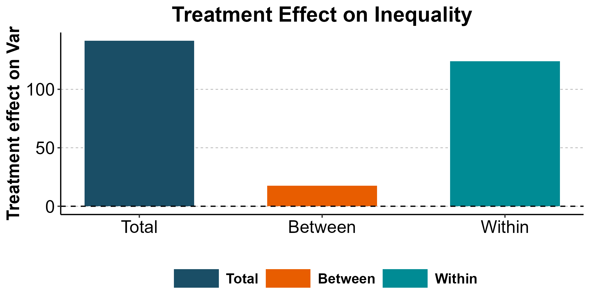

### Group-level contributions

The `type = "wibe.group"` plot shows each group’s contribution to the
within-group and between-group treatment effects:

``` r

plot(result, type = "wibe.group")
```

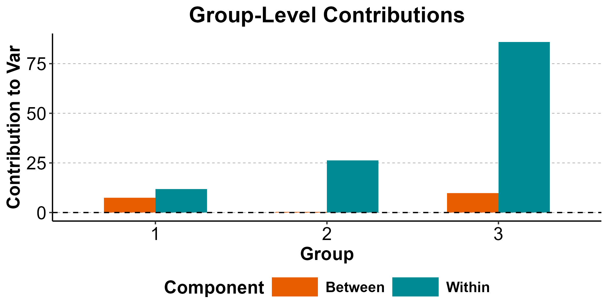

### Treatment effect parameters

The `type = "treat.params"` plot shows the estimated treatment effect
parameters ($`\beta`$ and $`\lambda`$) by group:

``` r

plot(result, type = "treat.params")
```

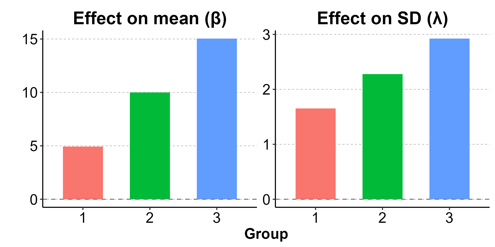

### Predicted outcomes

The `type = "outcome.params"` plot compares predicted group-level means
and standard deviations under control versus treatment:

``` r

plot(result, type = "outcome.params")
```

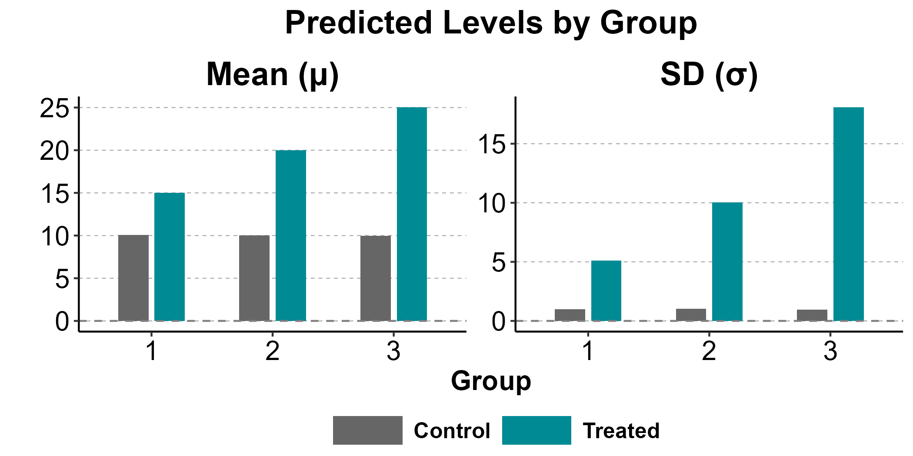

### Treatment effect distributions

The `type = "treat"` plot overlays the predicted treatment effect
distributions for each group. Use `type = "outcome"` to see the full
predicted outcome distributions under control vs treatment:

``` r

plot(result, type = "treat")
```

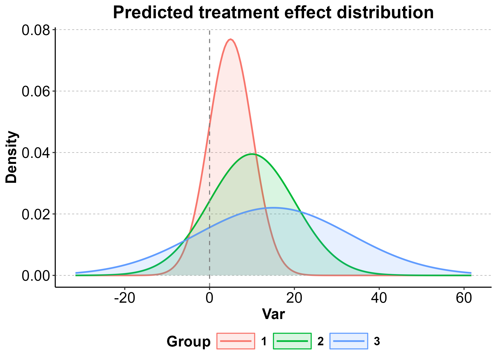

``` r

plot(result, type = "outcome")
```

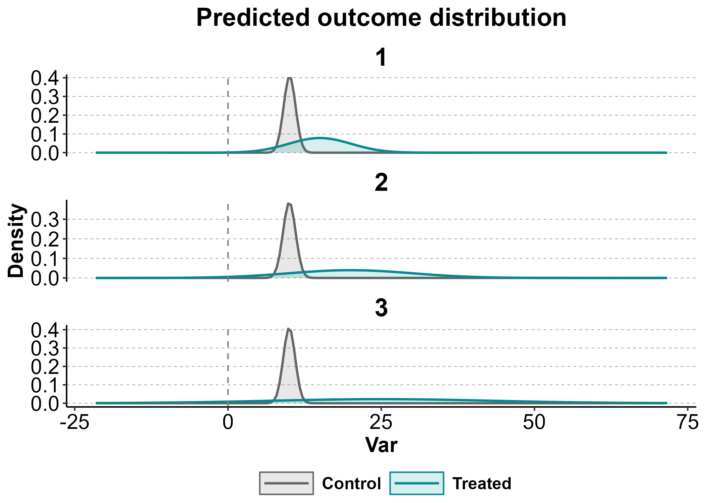

### Externally estimated model

For more control, create an `ineqx_params` object first and pass it to
[`ineqx()`](https://benrosche.github.io/ineqx/reference/ineqx.md):

``` r

# Extract params from a gamlss model
params <- ineqx_params(
  model = gamlss::gamlss(
    inc ~ x * factor(group) + factor(year),
    sigma.formula = ~ x * factor(group) + factor(year),
    data = incdat, family = gamlss.dist::NO()
  ),
  data  = incdat,
  treat = "x",
  group = "group",
  time  = "year",
  vcov  = TRUE
)
#> GAMLSS-RS iteration 1: Global Deviance = 17539.56 
#> GAMLSS-RS iteration 2: Global Deviance = 16626.77 
#> GAMLSS-RS iteration 3: Global Deviance = 16626.49 
#> GAMLSS-RS iteration 4: Global Deviance = 16626.49

print(params)
#> ineqx_params object
#>   Type: longitudinal 
#>   Inequality measure: Var 
#>   Groups (3): 1, 2, 3
#>   Time periods (5): 1, 2, 3, 4, 5
#> 
#> Group-level parameters:
#> 
#>   time 1:
#>      group     pi    mu0 sigma0   beta lambda
#>          1 0.4737 10.000 0.9100  4.951  1.652
#>          2 0.2632  9.954 0.9620  9.995  2.274
#>          3 0.2632  9.944 0.9028 14.365  2.894
#> 
#>   time 2:
#>      group     pi   mu0 sigma0   beta lambda
#>          1 0.4737 9.966 0.9507  4.951  1.652
#>          2 0.2632 9.920 1.0050  9.995  2.274
#>          3 0.2632 9.911 0.9431 14.365  2.894
#> 
#>   time 3:
#>      group     pi   mu0 sigma0   beta lambda
#>          1 0.4737 10.10 0.9916  4.951  1.652
#>          2 0.2632 10.05 1.0482  9.995  2.274
#>          3 0.2632 10.05 0.9837 14.365  2.894
#> 
#>   time 4:
#>      group     pi   mu0 sigma0   beta lambda
#>          1 0.4737 10.08 1.0018  4.951  1.652
#>          2 0.2632 10.04 1.0591  9.995  2.274
#>          3 0.2632 10.03 0.9939 14.365  2.894
#> 
#>   time 5:
#>      group     pi   mu0 sigma0   beta lambda
#>          1 0.4737 10.10  1.051  4.951  1.652
#>          2 0.2632 10.06  1.111  9.995  2.274
#>          3 0.2632 10.05  1.042 14.365  2.894
#> 
#> vcov: 5 time periods
```

### Longitudinal causal decomposition

With longitudinal parameters,
[`ineqx()`](https://benrosche.github.io/ineqx/reference/ineqx.md)
automatically performs the longitudinal decomposition:

``` r

result_longit <- ineqx(
  "inc",
  group  = "group",
  ref    = 1,
  order  = c("behavioral", "compositional", "pretreatment"),
  params = params,
  se     = "delta",
  data   = incdat
)
#> Computing decomposition...
#> Finished.

print(result_longit)
#> Longitudinal causal variance decomposition
#> Inequality measure: Var 
#> SEs via delta method
#> Reference period: 1 
#> Ordering: behavioral -> compositional -> pretreatment 
#> 
#> Treatment effect on variance by time:
#> (tau_B = Var(beta) + 2Cov(mu,beta);  tau_W = E(sigma^2)*E(f) + Cov(sigma^2,f);  tau_T = tau_B + tau_W)
#> 
#>  time  Var(beta)  2Cov(mu,beta)      tau_B E(sigma2)*E(f)  Cov(sigma2,f)      tau_W      tau_T   lambda=0   beta=hom 
#>     1    15.5392        -0.1934    15.3459       104.1931        -1.4450   102.7481   118.0939     <0.001     <0.001 
#>    SE   (2.4384)       (0.3789)   (2.3962)       (9.4268)       (6.0948)   (7.0774)   (7.4720)                       
#>     2    15.5392        -0.1934    15.3459       113.7054        -1.5770   112.1285   127.4743     <0.001     <0.001 
#>    SE   (2.4384)       (0.3789)   (2.3962)      (10.2875)       (6.6513)   (7.7235)   (8.0867)                       
#>     3    15.5392        -0.1934    15.3459       123.7010        -1.7156   121.9854   137.3313     <0.001     <0.001 
#>    SE   (2.4384)       (0.3789)   (2.3962)      (11.1918)       (7.2360)   (8.4024)   (8.7374)                       
#>     4    15.5392        -0.1934    15.3459       126.2725        -1.7512   124.5213   139.8671     <0.001     <0.001 
#>    SE   (2.4384)       (0.3789)   (2.3962)      (11.4245)       (7.3864)   (8.5771)   (8.9055)                       
#>     5    15.5392        -0.1934    15.3459       138.8845        -1.9262   136.9583   152.3042     <0.001     <0.001 
#>    SE   (2.4384)       (0.3789)   (2.3962)      (12.5655)       (8.1241)   (9.4338)   (9.7334)                       
#> 
#> Decomposition of changes in group-specific treatment effects on variance relative to ref = 1:
#> 
#>   time 1: (reference)
#> 
#>   time 2:
#>     Effects on means (delta_beta):                       0.0000  (SE = 3.4297)
#>     Effects on SDs (delta_lambda):                      -0.0000  (SE = 9.5802)
#>     Distribution of treatment (delta_pi):                0.0000  (SE = 0.0000)
#>       Between-group:                                     0.0000
#>       Within-group:                                      0.0000
#>     Pre-treatment inequality (delta_pre):                9.3804  (SE = 10.4581)
#>       Means:                                            -0.0000
#>       Variances:                                         9.3804
#>     Total:                                               9.3804  (SE = 11.0102)
#> 
#>   time 3:
#>     Effects on means (delta_beta):                       0.0000  (SE = 3.4297)
#>     Effects on SDs (delta_lambda):                      -0.0000  (SE = 9.5802)
#>     Distribution of treatment (delta_pi):                0.0000  (SE = 0.0000)
#>       Between-group:                                     0.0000
#>       Within-group:                                      0.0000
#>     Pre-treatment inequality (delta_pre):               19.2373  (SE = 10.7741)
#>       Means:                                             0.0000
#>       Variances:                                        19.2373
#>     Total:                                              19.2373  (SE = 11.4967)
#> 
#>   time 4:
#>     Effects on means (delta_beta):                       0.0000  (SE = 3.4297)
#>     Effects on SDs (delta_lambda):                      -0.0000  (SE = 9.5802)
#>     Distribution of treatment (delta_pi):                0.0000  (SE = 0.0000)
#>       Between-group:                                     0.0000
#>       Within-group:                                      0.0000
#>     Pre-treatment inequality (delta_pre):               21.7732  (SE = 10.8608)
#>       Means:                                             0.0000
#>       Variances:                                        21.7732
#>     Total:                                              21.7732  (SE = 11.6250)
#> 
#>   time 5:
#>     Effects on means (delta_beta):                       0.0000  (SE = 3.4297)
#>     Effects on SDs (delta_lambda):                       0.0000  (SE = 9.5802)
#>     Distribution of treatment (delta_pi):                0.0000  (SE = 0.0000)
#>       Between-group:                                     0.0000
#>       Within-group:                                      0.0000
#>     Pre-treatment inequality (delta_pre):               34.2102  (SE = 11.3153)
#>       Means:                                            -0.0000
#>       Variances:                                        34.2102
#>     Total:                                              34.2102  (SE = 12.2707)
```

The default `type = "decomp"` shows the three-component decomposition
(behavioral, compositional, pre-treatment) of changes relative to the
reference:

``` r

plot(result_longit)
```


### Six sub-component decomposition

Setting `show` to individual delta components displays the six
sub-components ($`\Delta_\beta`$, $`\Delta_\lambda`$,
$`\Delta_{\pi,b}`$, $`\Delta_{\pi,w}`$, $`\Delta_\mu`$,
$`\Delta_\sigma`$):

``` r

plot(result_longit, type = "decomp",
     show = c("delta_beta", "delta_lambda", "delta_pi_b",
              "delta_pi_w", "delta_mu", "delta_sigma"))
```

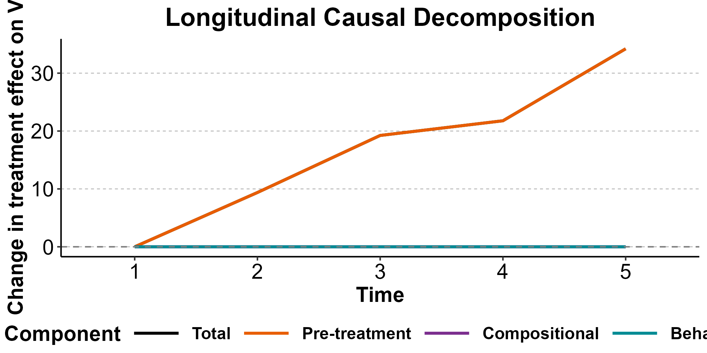

### Within- and between-group treatment effects

The `type = "wibe"` plot shows the *levels* of the cross-sectional
treatment effects ($`\tau_B`$, $`\tau_W`$) at each time point, rather
than changes from the reference. The `show` argument controls which
sub-components to display (default: `c("tau_b", "tau_w")`; also
available: `"het_b"`, `"cov_b"`, `"het_w"`, `"cov_w"`):

``` r

plot(result_longit, type = "wibe")
#> Ignoring unknown labels:
#> • fill : ""
```

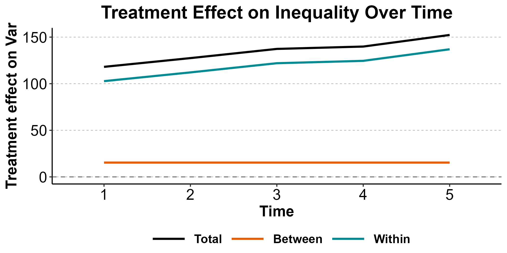

### Shapley values

Since the longitudinal decomposition depends on the ordering, you can
average across all 6 orderings with `order = "shapley"`:

``` r

result_shapley <- ineqx("inc", group = "group", ref = 1,
                         params = params, order = "shapley",
                         se = "none", data = incdat)
#> Computing decomposition...
#> Finished.
print(result_shapley)
#> Longitudinal causal variance decomposition
#> Inequality measure: Var 
#> Reference period: 1 
#> Ordering: Shapley (averaged across all 6 orderings)
#> 
#> Treatment effect on variance by time:
#> (tau_B = Var(beta) + 2Cov(mu,beta);  tau_W = E(sigma^2)*E(f) + Cov(sigma^2,f);  tau_T = tau_B + tau_W)
#> 
#>  time  Var(beta)  2Cov(mu,beta)      tau_B E(sigma2)*E(f)  Cov(sigma2,f)      tau_W      tau_T 
#>     1    15.5392        -0.1934    15.3459       104.1931        -1.4450   102.7481   118.0939 
#>     2    15.5392        -0.1934    15.3459       113.7054        -1.5770   112.1285   127.4743 
#>     3    15.5392        -0.1934    15.3459       123.7010        -1.7156   121.9854   137.3313 
#>     4    15.5392        -0.1934    15.3459       126.2725        -1.7512   124.5213   139.8671 
#>     5    15.5392        -0.1934    15.3459       138.8845        -1.9262   136.9583   152.3042 
#> 
#> Decomposition of changes in group-specific treatment effects on variance relative to ref = 1:
#> 
#>   time 1: (reference)
#> 
#>   time 2:
#>     Effects on means (delta_beta):                       0.0000
#>     Effects on SDs (delta_lambda):                      -0.0000
#>     Distribution of treatment (delta_pi):                0.0000
#>       Between-group:                                     0.0000
#>       Within-group:                                      0.0000
#>     Pre-treatment inequality (delta_pre):                9.3804
#>       Means:                                            -0.0000
#>       Variances:                                         9.3804
#>     Total:                                               9.3804
#> 
#>   time 3:
#>     Effects on means (delta_beta):                       0.0000
#>     Effects on SDs (delta_lambda):                      -0.0000
#>     Distribution of treatment (delta_pi):                0.0000
#>       Between-group:                                     0.0000
#>       Within-group:                                      0.0000
#>     Pre-treatment inequality (delta_pre):               19.2373
#>       Means:                                             0.0000
#>       Variances:                                        19.2373
#>     Total:                                              19.2373
#> 
#>   time 4:
#>     Effects on means (delta_beta):                       0.0000
#>     Effects on SDs (delta_lambda):                      -0.0000
#>     Distribution of treatment (delta_pi):                0.0000
#>       Between-group:                                     0.0000
#>       Within-group:                                      0.0000
#>     Pre-treatment inequality (delta_pre):               21.7732
#>       Means:                                             0.0000
#>       Variances:                                        21.7732
#>     Total:                                              21.7732
#> 
#>   time 5:
#>     Effects on means (delta_beta):                       0.0000
#>     Effects on SDs (delta_lambda):                       0.0000
#>     Distribution of treatment (delta_pi):                0.0000
#>       Between-group:                                     0.0000
#>       Within-group:                                      0.0000
#>     Pre-treatment inequality (delta_pre):               34.2102
#>       Means:                                            -0.0000
#>       Variances:                                        34.2102
#>     Total:                                              34.2102
```

``` r

plot(result_shapley)
```

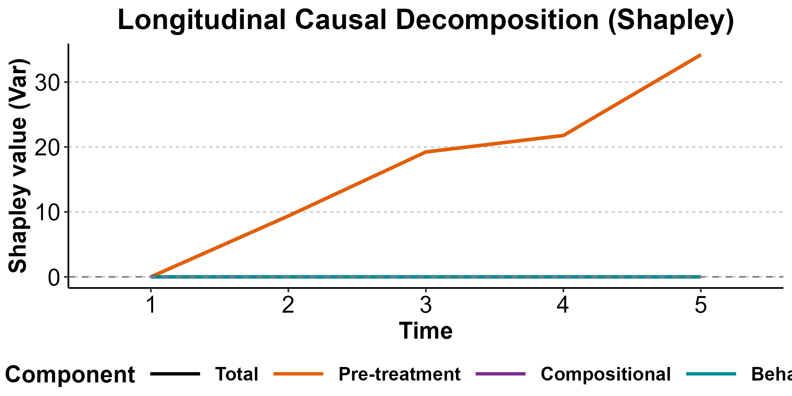

The `type = "shapley"` plot shows the Shapley-averaged values with
ribbons indicating the range across orderings — useful for assessing
ordering dependence:

``` r

plot(result_shapley, type = "shapley")
```

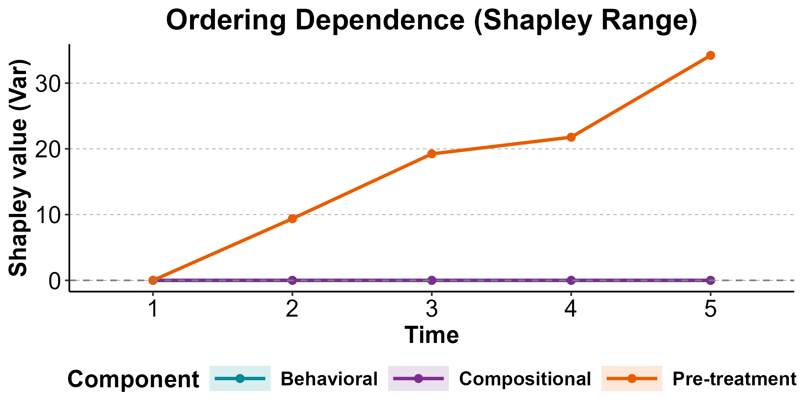

### Treatment effect parameters over time

The `type = "treat.params"` plot shows the estimated treatment effect
parameters ($`\beta`$ and $`\lambda`$) by group over time:

``` r

plot(result_shapley, type = "treat.params")
```

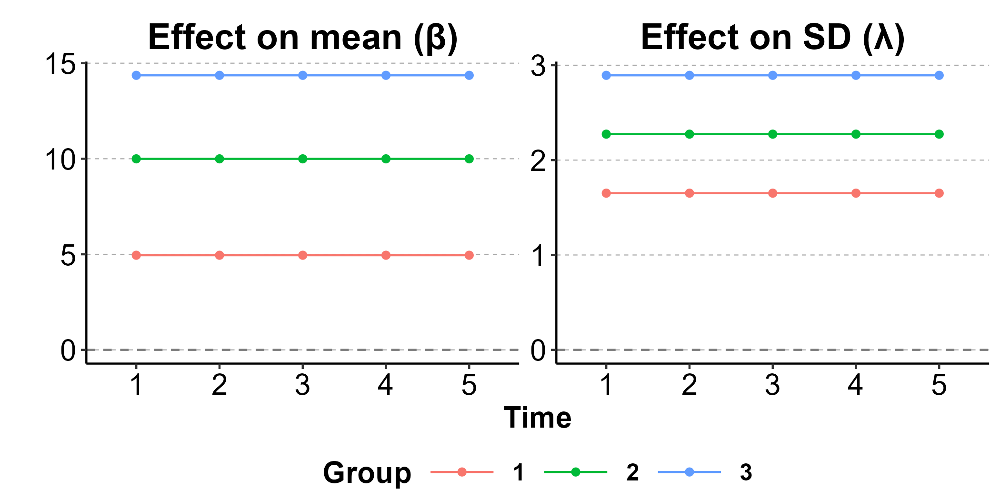

### Predicted outcomes over time

The `type = "outcome.params"` plot compares predicted group-level means
and standard deviations under control versus treatment over time:

``` r

plot(result_shapley, type = "outcome.params")
```

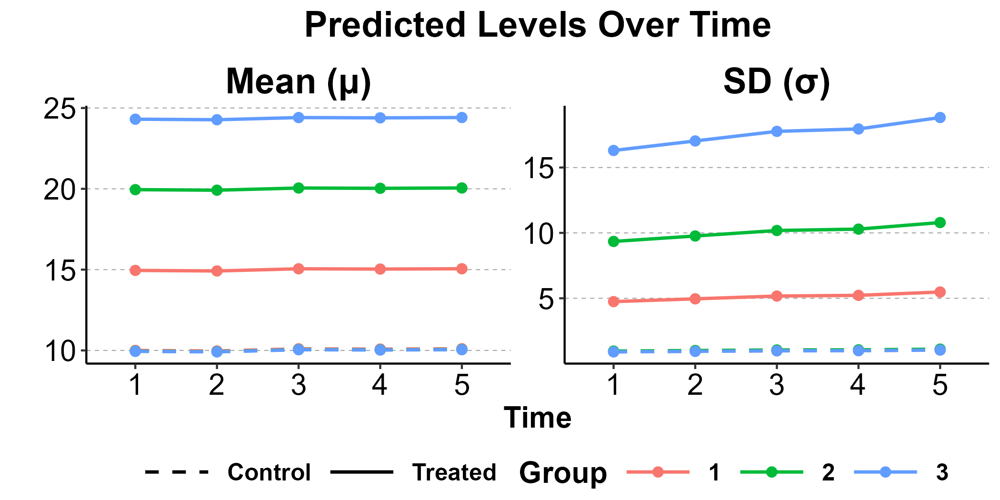

### Predicted distributions

The `type = "treat"` plot shows predicted treatment effect
distributions. When `time` is specified, it shows per-group
distributions at that time point. When `time = NULL` (default), it shows
pi-weighted marginal distributions across all time points. Use
`type = "outcome"` for predicted outcome distributions:

``` r

plot(result_shapley, type = "treat", time = 3)
```

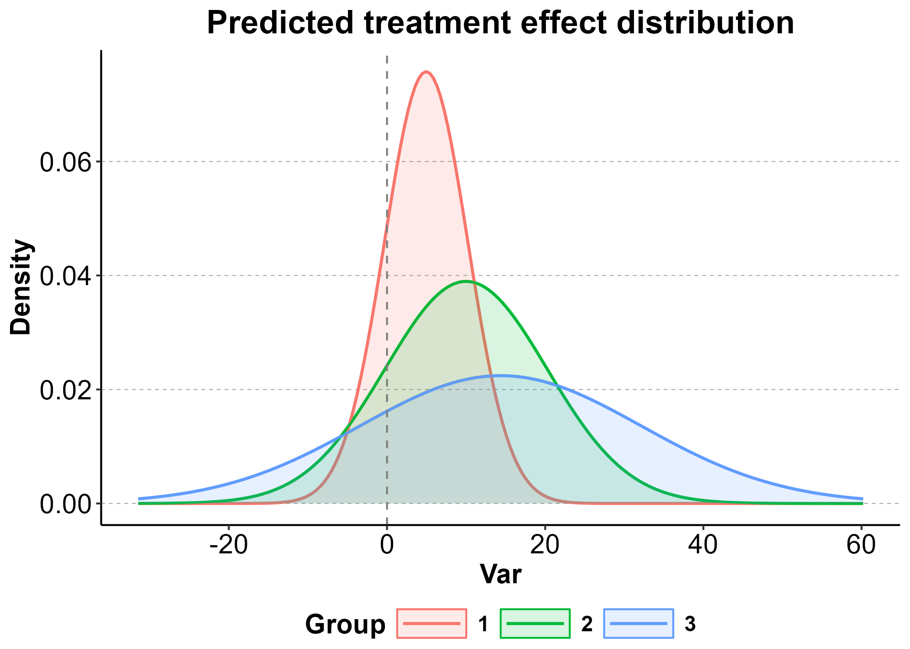

``` r

plot(result_shapley, type = "treat")
```

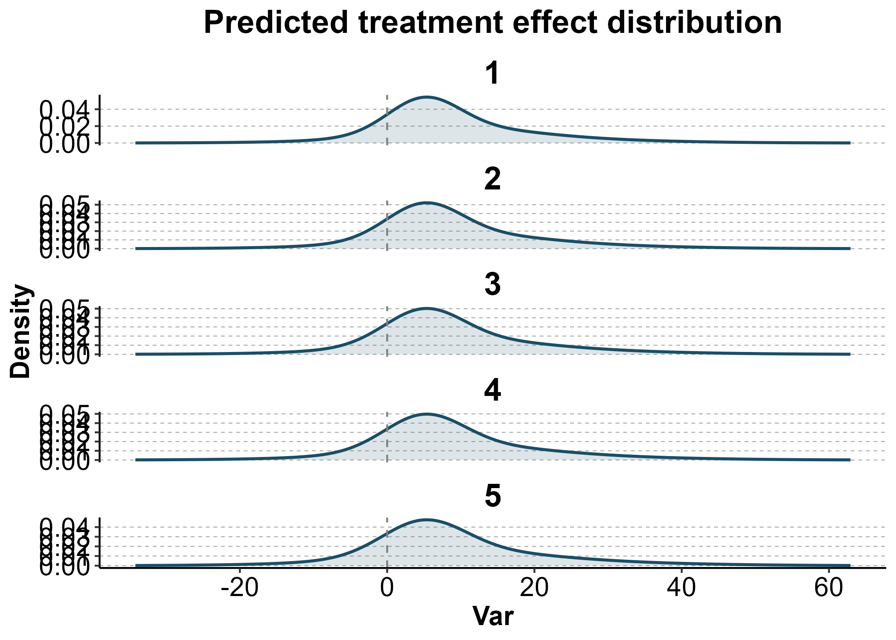

### Counterfactual reference (causal)

Just as the descriptive decomposition supports a counterfactual
baseline, the causal decomposition can blend user-provided
counterfactual parameters with model-estimated parameters from data.
This answers questions like: *“How did treatment effects on inequality
evolve relative to a hypothetical baseline?”*

Provide an `ineqx_params` object (with causal columns `mu0`, `sigma0`,
`beta`, `lambda`) together with `treat`, `formula_mu`, and
`formula_sigma`. The function fits a GAMLSS model on the data, then
blends the model-estimated parameters with your counterfactual
scenarios.

You can specify counterfactual parameters at multiple time points.
Periods covered by your params override the model estimates, while
remaining periods are estimated from data. Here we place two
counterfactual scenarios — one at the beginning (time 0: no treatment
effect) and one in the middle (time 3: moderate, uniform treatment
effect) — with data-estimated periods in between:

``` r

# Two counterfactual scenarios at time 0 and time 3
cf_ref <- ineqx_params(
  data = data.frame(
    group  = rep(1:3, 2),
    time   = rep(c(0, 3), each = 3),
    pi     = 1/3,
    mu0    = 10,
    sigma0 = 1,
    # time 0: no treatment effect
    # time 3: moderate uniform treatment effect
    beta   = c(0, 0, 0, 5, 5, 5),
    lambda = c(0, 0, 0, 1, 1, 1)
  )
)

result_blend <- ineqx(
  y             = "inc",
  treat         = "x",
  group         = "group",
  time          = "year",
  params        = cf_ref,
  ref           = 0,
  formula_mu    = ~ x * factor(group) + factor(year),
  formula_sigma = ~ x * factor(group) + factor(year),
  se            = "none",
  data          = incdat
)
#> GAMLSS-RS iteration 1: Global Deviance = 17539.56 
#> GAMLSS-RS iteration 2: Global Deviance = 16626.77 
#> GAMLSS-RS iteration 3: Global Deviance = 16626.49 
#> GAMLSS-RS iteration 4: Global Deviance = 16626.49

print(result_blend)
#> Longitudinal causal variance decomposition
#> Inequality measure: Var 
#> Reference period: 0 
#> Ordering: Shapley (averaged across all 6 orderings)
#> 
#> Treatment effect on variance by time:
#> (tau_B = Var(beta) + 2Cov(mu,beta);  tau_W = E(sigma^2)*E(f) + Cov(sigma^2,f);  tau_T = tau_B + tau_W)
#> 
#>  time  Var(beta)  2Cov(mu,beta)      tau_B E(sigma2)*E(f)  Cov(sigma2,f)      tau_W      tau_T 
#>     0     0.0000         0.0000     0.0000         0.0000         0.0000     0.0000     0.0000 
#>     1    15.5392        -0.1934    15.3459       104.1931        -1.4450   102.7481   118.0939 
#>     2    15.5392        -0.1934    15.3459       113.7054        -1.5770   112.1285   127.4743 
#>     3     0.0000         0.0000     0.0000         6.3891         0.0000     6.3891     6.3891 
#>     4    15.5392        -0.1934    15.3459       126.2725        -1.7512   124.5213   139.8671 
#>     5    15.5392        -0.1934    15.3459       138.8845        -1.9262   136.9583   152.3042 
#> 
#> Decomposition of changes in group-specific treatment effects on variance relative to ref = 0:
#> 
#>   time 0: (reference)
#> 
#>   time 1:
#>     Effects on means (delta_beta):                      15.0727
#>     Effects on SDs (delta_lambda):                     124.8056
#>     Distribution of treatment (delta_pi):              -11.1188
#>       Between-group:                                     0.3671
#>       Within-group:                                    -11.4859
#>     Pre-treatment inequality (delta_pre):              -10.6655
#>       Means:                                            -0.0939
#>       Variances:                                       -10.5716
#>     Total:                                             118.0939
#> 
#>   time 2:
#>     Effects on means (delta_beta):                      15.0727
#>     Effects on SDs (delta_lambda):                     129.8247
#>     Distribution of treatment (delta_pi):              -11.7766
#>       Between-group:                                     0.3671
#>       Within-group:                                    -12.1436
#>     Pre-treatment inequality (delta_pre):               -5.6464
#>       Means:                                            -0.0939
#>       Variances:                                        -5.5525
#>     Total:                                             127.4743
#> 
#>   time 3:
#>     Effects on means (delta_beta):                       0.0000
#>     Effects on SDs (delta_lambda):                       6.3891
#>     Distribution of treatment (delta_pi):                0.0000
#>       Between-group:                                     0.0000
#>       Within-group:                                      0.0000
#>     Pre-treatment inequality (delta_pre):                0.0000
#>       Means:                                             0.0000
#>       Variances:                                         0.0000
#>     Total:                                               6.3891
#> 
#>   time 4:
#>     Effects on means (delta_beta):                      15.0727
#>     Effects on SDs (delta_lambda):                     136.4555
#>     Distribution of treatment (delta_pi):              -12.6455
#>       Between-group:                                     0.3671
#>       Within-group:                                    -13.0126
#>     Pre-treatment inequality (delta_pre):                0.9844
#>       Means:                                            -0.0939
#>       Variances:                                         1.0783
#>     Total:                                             139.8671
#> 
#>   time 5:
#>     Effects on means (delta_beta):                      15.0727
#>     Effects on SDs (delta_lambda):                     143.1101
#>     Distribution of treatment (delta_pi):              -13.5176
#>       Between-group:                                     0.3671
#>       Within-group:                                    -13.8846
#>     Pre-treatment inequality (delta_pre):                7.6390
#>       Means:                                            -0.0939
#>       Variances:                                         7.7329
#>     Total:                                             152.3042
```

Time 0 and time 3 use the counterfactual parameters; times 1, 2, 4, and
5 are estimated from data via GAMLSS. The longitudinal decomposition
shows how treatment effects on inequality evolved across all periods
relative to the reference (time 0).

Note: delta method SEs are not available for blended parameters. Use
[`boot_config()`](https://benrosche.github.io/ineqx/reference/boot_config.md)
for bootstrap SEs if needed.

### Comparing scenarios

The
[`compare()`](https://benrosche.github.io/ineqx/reference/compare.md)
function stacks multiple ineqx results for side-by-side comparison. This
is useful for contrasting an observed decomposition with one or more
counterfactual baselines:

``` r

comp <- compare(Observed = result_shapley, Counterfactual = result_blend)
#> Warning in compare(Observed = result_shapley, Counterfactual = result_blend):
#> Objects have different reference periods: 1, 0. Using ref = 1
print(comp)
#> Comparison of 2 scenarios (ineqx_causal_longit, Var)
#> Reference: 1 
#> Scenarios: Observed, Counterfactual 
#> 
#> Decomposition by time and scenario:
#>  time     component Observed Counterfactual
#>     0    behavioral       NA         0.0000
#>     0 compositional       NA         0.0000
#>     0    delta_beta       NA         0.0000
#>     0  delta_lambda       NA         0.0000
#>     0      delta_mu       NA         0.0000
#>     0    delta_pi_b       NA         0.0000
#>     0    delta_pi_w       NA         0.0000
#>     0   delta_sigma       NA         0.0000
#>     0  pretreatment       NA         0.0000
#>     1    behavioral   0.0000       139.8783
#>     1 compositional   0.0000       -11.1188
#>     1    delta_beta   0.0000        15.0727
#>     1  delta_lambda   0.0000       124.8056
#>     1      delta_mu   0.0000        -0.0939
#>     1    delta_pi_b   0.0000         0.3671
#>     1    delta_pi_w   0.0000       -11.4859
#>     1   delta_sigma   0.0000       -10.5716
#>     1  pretreatment   0.0000       -10.6655
#>     2    behavioral   0.0000       144.8974
#>     2 compositional   0.0000       -11.7766
#>     2    delta_beta   0.0000        15.0727
#>     2  delta_lambda   0.0000       129.8247
#>     2      delta_mu   0.0000        -0.0939
#>     2    delta_pi_b   0.0000         0.3671
#>     2    delta_pi_w   0.0000       -12.1436
#>     2   delta_sigma   9.3804        -5.5525
#>     2  pretreatment   9.3804        -5.6464
#>     3    behavioral   0.0000         6.3891
#>     3 compositional   0.0000         0.0000
#>     3    delta_beta   0.0000         0.0000
#>     3  delta_lambda   0.0000         6.3891
#>     3      delta_mu   0.0000         0.0000
#>     3    delta_pi_b   0.0000         0.0000
#>     3    delta_pi_w   0.0000         0.0000
#>     3   delta_sigma  19.2373         0.0000
#>     3  pretreatment  19.2373         0.0000
#>     4    behavioral   0.0000       151.5282
#>     4 compositional   0.0000       -12.6455
#>     4    delta_beta   0.0000        15.0727
#>     4  delta_lambda   0.0000       136.4555
#>     4      delta_mu   0.0000        -0.0939
#>     4    delta_pi_b   0.0000         0.3671
#>     4    delta_pi_w   0.0000       -13.0126
#>     4   delta_sigma  21.7732         1.0783
#>     4  pretreatment  21.7732         0.9844
#>     5    behavioral   0.0000       158.1828
#>     5 compositional   0.0000       -13.5176
#>     5    delta_beta   0.0000        15.0727
#>     5  delta_lambda   0.0000       143.1101
#>     5      delta_mu   0.0000        -0.0939
#>     5    delta_pi_b   0.0000         0.3671
#>     5    delta_pi_w   0.0000       -13.8846
#>     5   delta_sigma  34.2102         7.7329
#>     5  pretreatment  34.2102         7.6390
```

The default `type = "decomp"` plot uses color for the decomposition
component and linetype for the scenario:

``` r

plot(comp, type = "decomp")
```


Use `show` to display individual sub-components:

``` r

plot(comp, type = "decomp",
     show = c("delta_beta", "delta_lambda", "delta_pi_b",
              "delta_pi_w", "delta_mu", "delta_sigma"))
```

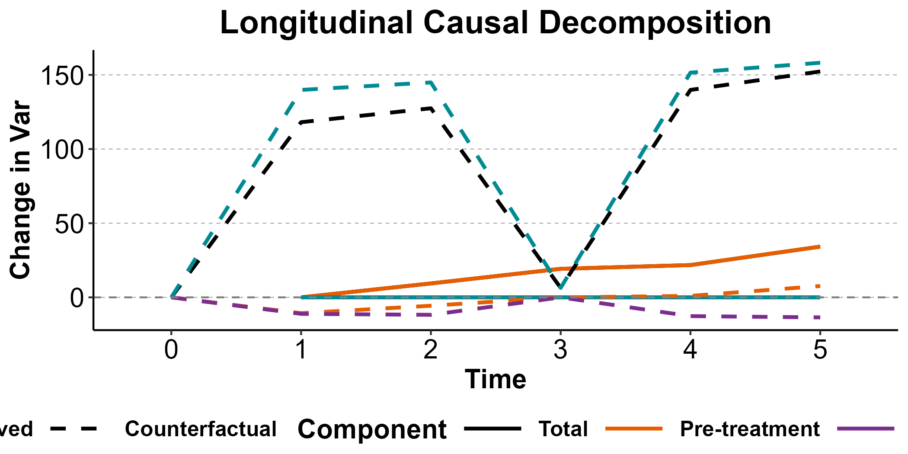

The `type = "wibe"` plot compares within/between treatment effect levels
across scenarios:

``` r

plot(comp, type = "wibe")
```

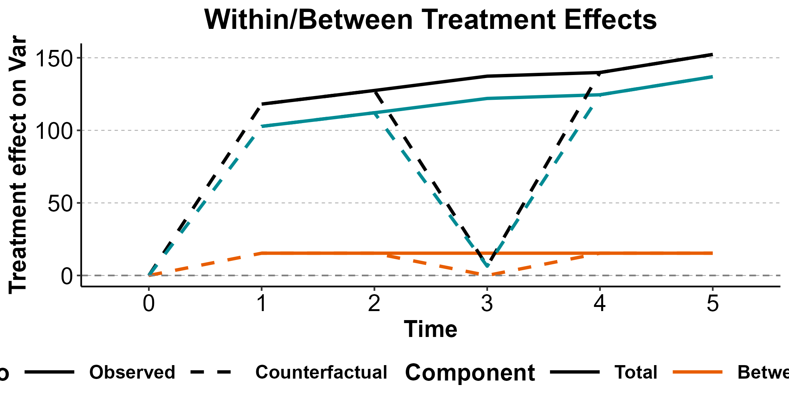

The underlying stacked data is accessible via `comp$data`.

------------------------------------------------------------------------

## 3. Using an external GAMLSS model

If you want full control over the model specification (e.g., different
distributions, random effects, custom controls), fit a `gamlss` model
yourself and pass it to
[`ineqx_params()`](https://benrosche.github.io/ineqx/reference/ineqx_params.md):

``` r

library(gamlss)

# Fit your own GAMLSS
my_model <- gamlss(
  formula       = inc ~ x * factor(group) + factor(t),
  sigma.formula = ~ x * factor(group) + factor(t),
  data          = incdat,
  family        = NO(),
  trace         = FALSE
)

# Extract parameters
params_ext <- ineqx_params(
  model = my_model,
  data  = incdat,
  treat = "x",
  group = "group",
  vcov  = TRUE
)

print(params_ext)
#> ineqx_params object
#>   Type: cross_sectional 
#>   Inequality measure: Var 
#>   Groups (3): 1, 2, 3
#> 
#> Group-level parameters:
#>    group     pi   mu0 sigma0   beta  lambda
#>        1 0.4737 13.87  4.191 0.1415 -0.3171
#>        2 0.2632 13.82  4.373 0.3946  0.2629
#>        3 0.2632 13.84  4.230 0.6273  0.9472
#> 
#> vcov: 12x12

# Decompose
ineqx(y="inc", group = "group", params = params_ext, data = incdat)
#> Cross-sectional causal variance decomposition
#> Inequality measure: Var 
#> SEs via delta method
#> 
#> Treatment effect on outcome variance:
#>     Var[Y | T = 0]:                         18.0601  (SE = 1.2547)
#>     Var[Y | T = 1]:                         44.2609  (SE = 2.0622)
#>     Total effect (tau_T):                   26.2008  (SE = 2.4139)
#>       Between-group (tau_B):                 0.0347  (SE = 0.0262)
#>       Within-group (tau_W):                 26.1662  (SE = 2.4138)
#>       -> Wald test H0: lambda = 0: chi2(3) = 501.2301, p < 0.0001
#>          Significant: evidence of treatment effect heterogeneity
#>       -> Wald test H0: beta homogeneous (constant absolute effect): chi2(2) = 4.3117, p = 0.1158
#>          Not significant: no evidence the mean effect differs across groups
#> 
#> Between-group sub-components:
#>     Var_pi(beta):                            0.0412  (SE = 0.0397)
#>     2*Cov_pi(mu0, beta):                    -0.0065  (SE = 0.0321)
#> 
#> Within-group sub-components:
#>     mean(sigma0^2) * mean(f):               26.1136  (SE = 2.8073)
#>     Cov_pi(sigma0^2, f):                     0.0526  (SE = 2.5861)
```

### Manual parameter specification

You can also construct `ineqx_params` by hand — useful for simulation
studies, sensitivity analyses, or replicating results from other
software:

``` r

params_manual <- ineqx_params(
  data = data.frame(
    group  = c("low", "mid", "high"),
    pi     = c(0.4, 0.35, 0.25),
    mu0    = c(300, 600, 1200),
    sigma0 = c(100, 200, 500),
    beta   = c(50, 80, 120),
    lambda = c(-0.05, -0.10, -0.15)
  ),
  ystat = "Var"
)

ineqx(y="inc", group = "group", params = params_manual,
      se = "none", data = incdat)
#> Computing decomposition...
#> Finished.
#> Cross-sectional causal variance decomposition
#> Inequality measure: Var 
#> 
#> Treatment effect on outcome variance:
#>     Var[Y | T = 0]:                      205600.0000
#>     Var[Y | T = 1]:                      206558.7190
#>     Total effect (tau_T):                  958.7190
#>       Between-group (tau_B):             20076.0000
#>       Within-group (tau_W):              -19117.2810
#> 
#> Between-group sub-components:
#>     Var_pi(beta):                          756.0000
#>     2*Cov_pi(mu0, beta):                 19320.0000
#> 
#> Within-group sub-components:
#>     mean(sigma0^2) * mean(f):            -13387.5295
#>     Cov_pi(sigma0^2, f):                 -5729.7515
```

------------------------------------------------------------------------

## Summary

| Workflow | Call | Input |
|----|----|----|
| Descriptive | `ineqx(y, group, data=...)` | Raw data |
| Descriptive (counterfactual ref) | `ineqx_params(data=...)` then `ineqx(y, group, params=..., data=...)` | Reference params + raw data |
| Causal (integrated) | `ineqx(y, treat, group, formula_mu=..., data=...)` | Raw data + treatment |
| Causal (counterfactual ref) | `ineqx_params(data=...)` then `ineqx(y, treat, group, params=..., formula_mu=..., data=...)` | Reference params + raw data + treatment |
| Causal (external model) | `ineqx_params(model=...)` then `ineqx(y, group, params=..., data=...)` | Fitted gamlss |
| Causal (manual) | `ineqx_params(data=...)` then `ineqx(y, group, params=..., data=...)` | Parameter data.frame |

For details on the methodology, see
[`vignette("model")`](https://benrosche.github.io/ineqx/articles/model.md).
For more examples, see
[`vignette("examples")`](https://benrosche.github.io/ineqx/articles/examples.md).
